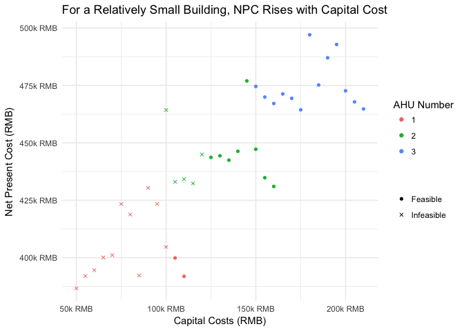

``` r
df %>%
  filter(AHU %in% c(1,2,3)) %>%
  ggplot(aes(x = Cap_ex, y = NPC, color = factor(AHU), shape = feasibility)) +
  geom_point() +
  scale_color_discrete() +
  scale_x_continuous(
    name = "Capital Costs (RMB)",
    labels = function(x) as.character(x / 1000) %>% str_c("k RMB")
  ) +
  scale_y_continuous(
    name = "Net Present Cost (RMB)",
    labels = function(y) as.character(y / 1000) %>% str_c("k RMB")
  ) +
  scale_shape_manual(name = "", values = c("Feasible" = 16, "Infeasible" = 4)) +
  labs(
    title = "For a Relatively Small Building, NPC Rises with Capital Cost",
    color = "AHU Number"
  ) +
  theme_minimal()
```


